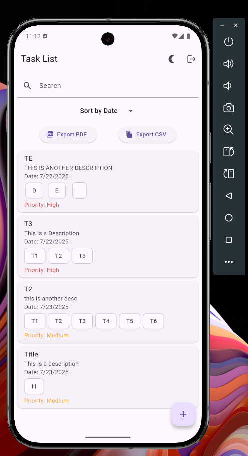

# 📱 Mobile To-Do List App with Supabase

A sleek and responsive mobile To-Do list app built with Flutter and Supabase. Supports modern task management features and is ready for cross-platform deployment (Android & iOS).

### Features

* 🌗 Dark / Light Mode support
* ✅ Add, delete, and reorder tasks
* 🔍 Search, filter, and sort by priority/date
* 🔐 Supabase Auth (Sign Up / Sign In)
* 🔄 Real-time sync with Supabase Realtime
* ☁️ Supabase as backend (Auth + DB + Storage)
* 📱 Flutter cross-platform UI

---

## 📸 Screenshots

<p float="left">
  
  
  
</p>

*Login, Task List View, and Add Task Form*

---

## 🚧 Roadmap

* [x] Supabase Auth integration
* [x] Create/read/delete task from database
* [x] Real-time sync with `supabase_flutter >= 2.0.0`
* [x] Light/Dark mode toggle
* [ ] Local notifications (via `flutter_local_notifications`)
* [ ] Offline support & sync
* [ ] Export to PDF/CSV (using `printing` and `csv`)
* [ ] Tag & priority filters
* [ ] Drag & drop reorder with `reorderable_list`

---

## 🧰 Prerequisites

* Flutter SDK (3.16+ recommended)
* Supabase project (with anon key + URL)
* Android Studio or Xcode for simulator/emulator
* Dart >= 3.2

---

## 🔧 Tech Stack

* **Frontend:** Flutter (Material 3), Provider / Riverpod (state)
* **Backend:** Supabase (Auth, Database, Realtime)
* **Packages:**

  * `supabase_flutter`
  * `flutter_hooks` or `hooks_riverpod`
  * `intl`, `fluttertoast`, `uuid`
  * `flutter_local_notifications` (planned)

---

## 🚀 Getting Started

### 1. Clone the Repo

```bash
git clone https://github.com/yourusername/flutter-todo-supabase.git
cd flutter-todo-supabase
```

### 2. Install Dependencies

```bash
flutter pub get
```

### 3. Supabase Setup

Create a table called `tasks` with the following structure:

| Column      | Type    | Notes                         |
| ----------- | ------- | ----------------------------- |
| id          | uuid    | Primary Key, default `uuid()` |
| title       | text    | Required                      |
| description | text    | Nullable                      |
| date        | date    | Nullable                      |
| tags        | text\[] | Nullable                      |
| priority    | text    | 'High', 'Medium', 'Low'       |
| order       | int     | Default 0                     |
| user\_id    | uuid    | Foreign key to `auth.users`   |

### 4. Add Supabase Keys

Create a `.env` file or configure your `supabase_flutter` like this:

```dart
await Supabase.initialize(
  url: 'https://your-project.supabase.co',
  anonKey: 'your-anon-key',
);
```

### 5. Enable Row-Level Security

Enable RLS and apply the following policy:

```sql
alter policy "Enable users to manage their own tasks"
on "public"."tasks"
to authenticated
using (user_id = auth.uid());
```

---

## 📦 Build & Run

To run the app on emulator or device:

```bash
flutter run
```

To build release APK:

```bash
flutter build apk --release
```

---

## 🛠 Troubleshooting

* **Blank task list?**

  * Ensure you're authenticated and `user_id` column is correctly assigned in insert logic.
* **Realtime updates not working?**

  * Ensure you're subscribing using `Supabase.instance.channel(...)` with correct filters.
* **Insert errors?**

  * Check that the user has permission via RLS and all required fields are being sent.

---

## ☁️ Deployment Targets

* Android (Play Store-ready)
* iOS (App Store-ready)
* Web (optional with Flutter web support)

---

## 📄 License

MIT © \Zaki Omer

---

## 📬 Contact

Questions or suggestions?

📧 [zakiomer@zamufey.com](mailto:zakiomer@zamufey.com)
